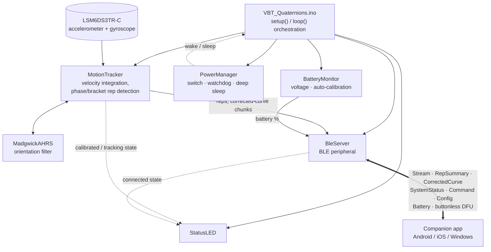
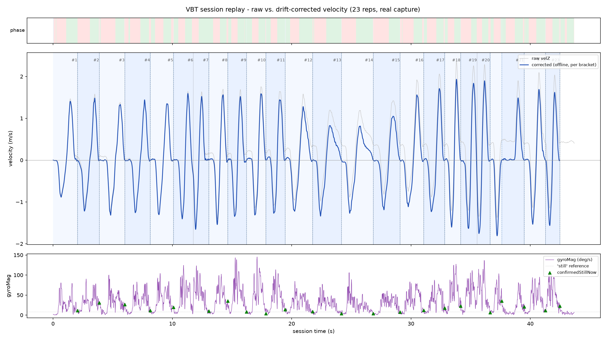
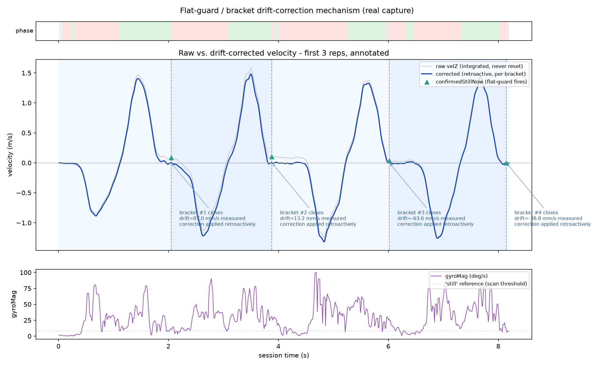

# ODKI VBT Firmware Documentation

**License note:** this document is covered by the same license as the firmware it describes — see [`LICENSE-FIRMWARE`](../LICENSE-FIRMWARE) (GPL-3.0 + Commons Clause) in the repository root. (The BLE wire protocol has its own, more permissive license — see the [License section](BLE_PROTOCOL.md#license) of `BLE_PROTOCOL.md`.)

This document describes the firmware that runs on the ODKI VBT sensor: a Seeed XIAO nRF52840 Sense (an nRF52840 microcontroller with an onboard LSM6DS3TR-C accelerometer/gyroscope), programmed with the Arduino framework. It is organized as one chapter per source file, in roughly the order a newcomer should read them: the entry point first, then the core rep-detection algorithm, then BLE, then the supporting hardware modules.

## What the device does

The sensor clips onto a barbell or is held during a lift. Once calibrated (held still for the CALIBRATE command) and started (the START command), it:

1. Fuses its accelerometer and gyroscope into a stable 3D orientation estimate.
2. Uses that orientation to isolate real (muscular) acceleration from gravity, and expresses it along a fixed vertical axis in the world, regardless of how the sensor is oriented on the bar.
3. Integrates that acceleration into velocity, continuously correcting for drift using brief moments of genuine stillness between reps.
4. Detects individual reps from the resulting velocity signal — including recovering multiple reps from a continuous set where the athlete never fully pauses between them — and reports peak/mean velocity, acceleration, displacement, and a data-quality score for each one.
5. Streams live telemetry and per-rep results to a companion app over Bluetooth Low Energy, and can log raw per-sample data over USB serial for offline analysis.

## Module map

| File | Responsibility |
|---|---|
| `VBT_Quaternions.ino` | Top-level orchestration: wires the modules together in `setup()`/`loop()`. |
| `Config.h` | Shared build-time constants (pins, firmware version, timing). |
| `MotionTracker.h` / `.cpp` | The core algorithm: IMU fusion, velocity integration, rep detection. |
| `BleServer.h` / `.cpp` | The Bluetooth peripheral: custom streaming/control service, wire protocol. |
| `MadgwickAHRS.h` / `.cpp` | The orientation filter (accelerometer + gyroscope sensor fusion). |
| `PowerManager.h` / `.cpp` | Power switch handling, hardware watchdog, deep sleep. |
| `BatteryMonitor.h` / `.cpp` | LiPo voltage reading, charge percentage, self-calibration. |
| `StatusLED.h` / `.cpp` | The onboard RGB status LED. |

The diagram below shows how these fit together at runtime — `VBT_Quaternions.ino` orchestrates every module from `setup()`/`loop()`; the only module that talks to the outside world is `BleServer`, over the custom BLE service described in its chapter.

## Required libraries

- **Seeed Arduino LSM6DS3** (Seeed Studio) — IMU driver.
- **Bluefruit52Lib** — ships with the `Seeeduino:nrf52` Arduino board package; no separate install needed.
- **Adafruit TinyUSB** — USB CDC serial, used for the debug log.

Board package: `Seeeduino:nrf52`, board `xiaonRF52840Sense`.

## Tooling

`tools/vbt_log_viewer.py` is a Python companion script for the raw debug log described in the [Lab data capture](#lab-data-capture-serial-log) section below. It parses a capture (opening a serial connection to the sensor is now enough to produce one, see that section — v3.11.24), offline-reconstructs the drift-corrected curve with the exact same formula the firmware uses, prints a per-rep recap and an anomaly scan to the console, and plots raw vs. corrected velocity — either as a static overview (`python vbt_log_viewer.py session.log --save overview.png`) or as an animated real-time playback (`--live`). It's what produced both images in the MotionTracker chapter, from a real capture. Requires `numpy`, `pandas`, and `matplotlib` (`pip install numpy pandas matplotlib`).

`tools/vbt_live_monitor.py` (v3.11.25+) is a Tkinter GUI that opens the same USB-serial connection *live* instead of replaying a saved file: a rolling chart of raw and/or corrected velocity (togglable — raw / live / both) with the flat-guard's ±0.20 m/s ceiling and every confirmed-stillness/discarded-phase event marked, acceleration, a big current-phase/rep readout, a table of completed reps as they're scored, and a console for every other line the firmware prints (battery, BLE messages, calibration warnings). Its Calibrate/Start/Stop buttons send the plain-text `CALIBRATE`/`START`/`STOP` serial commands added in v3.11.21/v3.11.22 (`pollSerialCommands()` in the .ino) — the whole tracking lifecycle can now be driven without the phone app, and since v3.11.24 the sensor starts printing its raw log the moment this tool's serial connection opens (see [Lab data capture](#lab-data-capture-serial-log)) — no app step needed for that either; only the runtime Config (rep direction, phase thresholds, …) is still BLE-only. A Delay dropdown next to START (off, or 5–30s in steps of 5) is a self-timer local to the tool — it holds off sending `START` for that long, counting down in the big phase readout, so whoever's about to lift has time to get under the bar; the firmware itself is unaware of it and still receives a plain immediate `START` once the count reaches zero. It can optionally record every raw line to a `.log` file as it streams, which `vbt_log_viewer.py` can then replay offline. Requires `pyserial`, `numpy`, and `matplotlib` (`pip install pyserial numpy matplotlib`) plus Tkinter (bundled with the python.org installers; `sudo apt install python3-tk` on Debian/Ubuntu).

**v3.11.25 — redraw throttling:** user-reported high CPU/heat during use, and stalls when the window was resized to fullscreen or a dropdown was opened. The matplotlib redraw — not the 100Hz serial read, which stays cheap — is the actual cost, and it used to run on a fixed ~20fps timer regardless of whether anything had changed, including while idle, disconnected, or paused. It's now skipped entirely when nothing new arrived since the last frame, and throttled to ~8fps while actively streaming (see the module docstring for the full explanation, including why this was also the root cause of the fullscreen/dropdown stalls — Tkinter is single-threaded, so a background timer doing expensive rendering was competing with the OS's own resize/popup handling on the same thread). `SampleBuffer` is also now capped to the largest selectable window (60s, was 10 minutes of history nothing ever displays), so the per-frame cost stays constant instead of slowly growing over a long session.

---

## VBT_Quaternions.ino

The top-level sketch. Deliberately thin — its only job is wiring the other modules together in `setup()`/`loop()`; all the actual logic lives in the modules it calls into (`MotionTracker`, `BleServer`, `PowerManager`, `BatteryMonitor`, `StatusLED`).

**`setup()`**: brings up power management and the status LED first (so a very early failure is still visible), then the battery monitor, then logs the reset reason (useful for distinguishing a normal power-on from a watchdog-triggered recovery — see the PowerManager chapter), then starts BLE — which must happen before any possible call to deep sleep, since sleep entry depends on the BLE SoftDevice already being active — and finally the IMU. If the power switch isn't closed at boot, or the IMU fails to initialize, the device goes back to sleep or halts (blinking its status LED) rather than continuing in a half-working state.

**`loop()`** runs, in order:
1. Feeds the watchdog first, so anything that hangs further down in this same iteration (including a hang inside `goToSleep()` itself) still gets caught.
2. Checks the power switch; goes back to sleep if it's open.
3. Recomputes the status LED from current state.
4. Drains any pending BLE command (CALIBRATE / START / STOP) and any pending Config write, applying each to `MotionTracker`.
4b. Drains any pending **serial** command (v3.11.21/v3.11.22, `pollSerialCommands()`) — `START`/`STOP`/`CALIBRATE`, as plain newline-terminated text (case-insensitive), mirroring the same guarded calls used for the BLE versions of each. Added for `tools/vbt_live_monitor.py`, a desktop tool with no BLE access. `CALIBRATE` is exactly as blocking and pose-sensitive here as over BLE (~2s, device held still — see `MotionTracker::calibrateOrientation()`) — this only adds a second way to trigger it, not a gentler one. Runtime Config stays BLE-only deliberately — it already has a typed BLE packet (see `BleServer.h`) a text command would just duplicate. Reads `Serial.available()` one character at a time into a small fixed buffer rather than `Serial.readStringUntil()` — the latter blocks up to `Serial`'s timeout (1s by default) when a line arrives incomplete, which would stall the 100Hz sampling loop; this way an incomplete or malformed line just waits harmlessly in the buffer for its next character, or resets if the buffer's 16-byte cap is exceeded.
5. Reports battery status, gated to once every `Config::BATTERY_CHECK_INTERVAL_MS`, independent of tracking state.
6. Calls `MotionTracker::update()`, which self-limits to 100Hz internally and returns `true` only when it actually computed a new sample — everything below is gated on that, since `loop()` itself runs much faster than 100Hz and would otherwise repeat stale work between real updates.
7. If a new sample was computed and tracking is active: attempts to deliver one completed rep, then one queued corrected-curve chunk (see the MotionTracker and BleServer chapters for why both of these are peek/pop patterns rather than a single blocking send), then, decimated to 20Hz and only when the raw debug log isn't active, sends the live Stream packet.
## Config

The smallest file in the firmware: four build-time constants that don't belong to any single module.

- `WAKE_PIN` (`D6`) — the power switch input pin, shared between `PowerManager` (reading it) and the pin-mode setup that happens there.
- `FirmwareVersion::{MAJOR, MINOR, PATCH}` — the firmware version, exposed over BLE via the standard Device Information Service (see the BleServer chapter) so the companion app can compare it against the latest available release and offer an OTA update without any manual step from the user. Increment on every release.
- `Config::BATTERY_CHECK_INTERVAL_MS` (30000) — how often the main loop re-reads and reports battery status, independent of whether tracking is active.
- `Config::STREAM_DECIMATION_FACTOR` (5) — the internal IMU/motion-tracking loop runs at 100Hz, but the BLE Stream characteristic sends only 1 sample in every N, to avoid saturating the connection: 100Hz / 5 = 20Hz over the air.

## MotionTracker

This is the core of the firmware: it reads the IMU, fuses it into a stable orientation, integrates that into a vertical velocity, and turns that velocity signal into discrete, measured reps. Everything else in the firmware (BLE streaming, the live LED, the debug log) is a consumer of what this module produces.

The rep-detection engine was rebuilt from scratch in v3.11.0 (replacing an earlier zero-velocity-update/ZUPT design used through v3.10.x) after real-hardware testing kept surfacing the same structural problem: any scheme that periodically forces the integrated velocity back to exactly zero has to decide, sample by sample, whether "the sensor looks quiet" really means "the sensor is at rest" — and during a slow rep, or right at a rep's own peak (where acceleration crosses zero by definition), those two things can look identical for a moment. The current design sidesteps the problem instead of patching around it: **the integrated velocity is never reset**. It is always the true, raw integral of acceleration, so it can never "jump". Genuine stillness is still detected — it's what makes the whole system work — but instead of being used to *reset* the signal, it's used to *measure how far the signal has drifted* since the last time the sensor was still, and that measured drift is then subtracted back out **retroactively**, across the whole interval it accumulated over. Two independent scan tools exist to see this in practice — a live per-sample debug log (see [Lab data capture](#lab-data-capture-serial-log) below) and the `tools/vbt_log_viewer.py` companion script, which replays a captured log exactly as the algorithm saw it and produces the plots referenced throughout this chapter.

### Pipeline overview

Every sample (100Hz, gated inside `update()`) goes through:

1. **`updateOrientationAndAcceleration()`** — reads the IMU, runs the Madgwick filter to get an orientation quaternion, and uses that orientation to split the raw accelerometer reading into gravity and *linear* acceleration, expressed in a fixed world frame instead of the sensor's own (rotating) frame. Also drives the two continuous bias estimates (below).
2. **`stepPhaseEngine()`** (called from `integrateMotion()`) — integrates world-frame vertical acceleration into a velocity that is *never* reset, decides moment to moment whether a rep **phase** (a concentric or eccentric half-rep) should open or close, and separately decides whether the sensor is genuinely still right now. Every sample is also appended to a rolling **bracket** buffer.
3. **Bracket close** — whenever a genuine stillness event begins, the bracket that has been accumulating since the *previous* stillness event closes: the drift it picked up is measured directly (raw velocity vs. the last known-good reference) and distributed back across every sample in that bracket, retroactively. Any phase that closed while inside that bracket gets rescored on the now-corrected curve and re-reported.
4. Two small FIFO queues — completed reps and corrected-curve chunks — hold results until `VBT_Quaternions.ino` successfully delivers each one over BLE, one at a time.

The image below shows the whole mechanism on a real capture (23 reps, 43.7s, `tools/vbt_log_viewer.py test_log.txt`): the grey line is the raw, never-reset integral; the blue line is what the corrected curve looks like once every bracket in the session has closed. Notice the raw curve visibly creeping upward as a baseline offset over the course of the set — pure integration drift — while the corrected curve keeps returning cleanly to zero between reps.

### Sensor reading and orientation

The LSM6DS3 IMU samples internally at 416Hz, but processing runs at 100Hz. `FastSampleAccumulator::poll()` is called on every `loop()` iteration (much faster than 100Hz) and accumulates every genuinely new IMU sample by checking the status register directly; `harvest()` averages whatever arrived since the last processed sample. This means no IMU sample is silently dropped between two 10ms ticks — they're all averaged in, which is a basic anti-aliasing measure.

Both the raw accelerometer and gyroscope readings pass through a 5-sample median filter (`MedianFilter3`) before anything else touches them. A median filter (not a moving average) rejects an *isolated* outlier sample (e.g. the mechanical shock of a barbell touching the floor, or an occasional I2C/BLE-radio glitch) almost entirely, while barely affecting a real, sustained acceleration that spans several consecutive samples the way muscular effort does. It costs (N-1)/2 samples of latency (20ms at N=5).

The gyroscope, converted to rad/s after bias subtraction, and the filtered accelerometer feed a [Madgwick AHRS filter](#madgwickahrs) with an *adaptive* gain: the filter's `beta` (how strongly the accelerometer correction pulls the orientation estimate) is scaled down whenever the measured acceleration magnitude departs from gravity — i.e. during real motion, when the accelerometer is no longer a trustworthy "down" reference. A floor (`TRUST_FLOOR`) keeps a minimum correction active even during a long explosive movement, so orientation never relies purely on the gyroscope (which would drift unboundedly) for an extended stretch.

The resulting quaternion is used to:
- Subtract gravity from the raw accelerometer reading, in the sensor's own frame, yielding `linAcc*` — genuine linear (muscular) acceleration.
- Rotate `linAcc*` into the world frame (`worldAcc*`), where "vertical" is a fixed axis regardless of how the sensor is oriented on the barbell/limb.

### Continuous bias estimation

Two slow-moving biases are estimated continuously, both gated on the *same* "is the sensor truly still right now" condition (low gyroscope magnitude AND accelerometer magnitude **flat** over a short sliding window), sustained for `RuntimeConfig::accZBiasIdleStillTimeS`:

- **`accZBias`** (now `accBiasVec`, see the v3.11.13 note below) — even a well-calibrated orientation leaves a small residual offset on the world-frame vertical acceleration (alignment error, slow orientation drift during motion). Without correcting for it, integrated velocity would never return to exactly zero at rest. Estimated with a ~2s time constant, frozen during real motion. Tuned via `RuntimeConfig::accZBiasGyroMaxDegS`/`accZBiasAccMagToleranceMps2` (the "quiet enough to trust" thresholds).
- **Gyroscope bias** — the zero-rate offset seeded once during `calibrateOrientation()` can shift during a session (typically thermal drift as the chip warms up). Left uncorrected, a stale bias slowly rotates the estimated "up" direction, which is the most likely cause of a slow `accZBias` drift on long sessions. Uses a much slower ~8s time constant (`RuntimeConfig::gyroBiasIdleStillTimeS` gates when it engages), since the goal here is tracking thermal drift, not reacting quickly.

This is the same raw, IMU-only stillness signal (gyroscope magnitude + the accelerometer-magnitude flatness window, nothing derived from the velocity estimate itself) that also backs the flat-guard override described below — it is deliberately kept independent of any velocity-based judgment of "quiet."

**v3.11.11 fix — why "flat" instead of "close to `G`":** earlier versions gated the accelerometer half of this condition on `|accMag − G| < accZBiasAccMagToleranceMps2` — an *absolute* comparison against gravity. That's only reliable if the accelerometer's magnitude scale (`accelScaleG`, fit once, isotropically, in `calibrateOrientation()`) corrects the sensor perfectly at *every* orientation, which a single scalar generally can't do on a real MEMS part with any per-axis sensitivity mismatch. At a resting orientation different from the one used at calibration time, `accMag` could read stably outside tolerance while the device was genuinely still (gyroscope confirmed near-zero), permanently blocking both bias updates and leaving `accZBias` frozen at a value inherited from a previous session/orientation — diagnosed on a real capture that was pure rotation with no translation at all, where this froze `accZBias` for 8.8s and drove `velZ` to the safety clamp. The gate now checks that `accMag` is *flat* (low excursion) over a short window instead, which is orientation-independent by construction and needs no protocol change (it reuses `accZBiasAccMagToleranceMps2` as the excursion half-band rather than an absolute-difference tolerance).

**v3.11.13 fix — a vector, not a scalar:** even after the fix above, real hardware logs showed the residual itself isn't constant — it depends on the device's *current* orientation (0.33 m/s² near the calibration orientation, 0.15 m/s² at a moderate tilt, on the same capture), because a single isotropic accelerometer scale factor can't fully correct a real MEMS part's per-axis sensitivity mismatch at every attitude. `accZBias` was replaced with `accBiasVec`, a fixed vector in the sensor's own body frame, projected onto the *current* gravity direction (`gravBodyX/Y/Z`, already computed every sample from the orientation quaternion) to get the correction to apply right now — it adapts as the device's orientation changes, including during motion, not just at the one orientation it happened to be resting at when the estimate last updated. The update rule is the same single-observation LMS step as before, just applied to a 3-vector instead of a scalar (it reduces to the exact old scalar EMA in the special case where gravity's direction in the body frame never changes). This corrects the *symptom* in the velocity domain using the existing single-position `calibrateOrientation()` — it does not fix the anisotropy in the Madgwick orientation estimate itself, which would need a proper multi-position, per-axis accelerometer calibration.

**v3.11.14 fix — from a cumulative counter to a sliding window:** the "quiet enough to trust" signal itself used to be a single cumulative duration counter (`accZBiasStillDuration`) that reset **completely** to zero on the very first violation — one isolated noisy sample (a rack or floor vibration, a hand not perfectly still) threw away all the time already accumulated, forcing a full wait from scratch. This made both bias updates *and* the flat-guard override (below) far slower and more unpredictable than they needed to be in a normal, slightly noisy environment. It's now the same sliding-window logic already used elsewhere in this engine (`excursionFlat`/`absoluteFlat`, generalized to take the ring's capacity as an explicit parameter): raw gyroscope magnitude and accelerometer magnitude are kept on two rolling history buffers, and each of the three timers that depend on this signal (`accZBiasIdleStillTimeS`, `gyroBiasIdleStillTimeS`, and `flatGuardOverrideStillTimeS` below) just checks a different window length over the *same* two buffers. An isolated bad sample now costs at most one window's worth of delay — it ages out on its own — never a full reset.

### Velocity integration — never reset

`velZ` is the authoritative signed vertical velocity: positive is up, negative is down, always, independent of which direction is configured as the "concentric" one (`RuntimeConfig::repDirection`, applied once via a `+1/-1` sign multiplier immediately after integration — every other part of the engine works on the already-oriented value). It is integrated trapezoidally from `worldAccZ` every sample and — this is the structural change from the old design — **never touched again**: not zeroed, and (since v3.11.19) not clamped either. Whatever bias remains after the continuous `accZBias` correction above accumulates in `velZ` indefinitely; correcting for that accumulated drift is the entire job of the bracket mechanism below, not of the integration step itself. `±RuntimeConfig::maxPlausibleVelocityMps` is still a hard sanity ceiling, but it applies to `velZLive` (the corrected estimate computed a few lines later, see [Rep phases](#rep-phases-opening-and-closing) below) — clamping `velZ` itself, as earlier versions did, meant a long or touch-and-go set that legitimately drifted past 4&nbsp;m/s (drift, never real bar speed) fed a *clipped* raw sample into the bracket's drift measurement and the corrected-curve math, silently corrupting both for as long as the clamp was active.

### Mechanical shocks (open issue)

A mechanical shock — the bar briefly touching the floor between the eccentric and the concentric, most common in a touch-and-go deadlift or squat — produces a near-**instantaneous** jump in `worldAccZ` that a genuine muscular push never does, and that jump integrates directly into `velZ` as a real, if brief, error. The bracket mechanism (below) doesn't fully absorb it: it corrects drift **linearly over time** across a whole interval, the *opposite* shape from a shock's error (a step concentrated in a handful of samples), so the peak/mean of whichever phase the shock falls inside can stay measurably off even after correction — confirmed on a real capture (8 squats with progressively stronger intentional shocks), where the sharpest one reported a final, fully-corrected peak velocity off by ~0.15–0.22 m/s.

A jerk-based filter (holding the previous sample's value whenever the change from one sample to the next was implausibly large) was tried and briefly shipped, then removed: it fixed the isolated-shock case above, but made drift measurably *worse* on a different real capture of continuous, rapidly-alternating shaking — holding through one side of a pair of closely-spaced opposing spikes can swallow the natural cancellation that plain, unfiltered integration would otherwise provide on its own, since the two spikes largely cancel each other out if left alone. A short moving-average low-pass on `velZ` was evaluated as a safer alternative — it never made drift worse in that same capture — but was too weak at a window short enough to avoid also flattening genuine fast-rep peaks once widened enough to meaningfully help the isolated-shock case.

No mitigation is currently active. This remains an open problem — see the project's issue tracker / contribution history for the reasoning above if picking this up again.

### Rep phases: opening and closing

A **phase** is one concentric or eccentric half-rep — the same concept the very first (pre-ZUPT) version of this firmware used, now evaluated on a corrected estimate rather than the raw one (see the next section for why that distinction matters). A phase opens when the current best-estimate velocity crosses `RuntimeConfig::phaseStartVelocityMps` in either direction, and closes for one of three reasons:

- **Flat** — the flat-guard (below) confirms the sensor has gone still. This is what ends a normal rep.
- **Reversal** — the velocity has been moving the opposite way for `RuntimeConfig::reversalConfirmSamples` consecutive samples: the athlete changed direction without a real pause (e.g. bottom of a squat with no dead stop).
- **Timeout** — the phase has been open longer than `RuntimeConfig::maxPhaseDurationS`, a safety net against a phase that never resolves.

Two reps form a pair: an eccentric phase followed by the concentric phase that completes it. `RepResult` is only reported once the concentric side is known (see [Correction status](#correction-status-and-re-reporting) below); the eccentric side, if present, is folded in alongside it.

**v3.11.18 fix — rep numbering assumed phases always alternate direction:** the rep counter (`currentRepNumberEngine`) used to advance only when a phase closed in the *opposite* direction from the last one that closed (tracked via a `lastPhaseType` variable) — an assumption that a real capture broke: one concentric phase closed and was immediately followed by another concentric phase in the same direction, with no real reversal in between (visible in the raw log as one smooth, uninterrupted ascent silently cut into two "reps" by the engine — almost certainly a spurious flat/reversal false-trigger, not a genuine direction change). Once that happens, the alternation assumption never recovers: every eccentric phase reported afterward gets attributed to the *previous* rep's slot instead of its own, permanently, for the rest of the session — confirmed in the diagnosed capture from that point through its end. Fixed by making the counter advance unconditionally whenever a **concentric** phase closes, regardless of what closed before it — a rep is complete once its concentric phase closes, by definition, independent of anything else. `lastPhaseType` is gone entirely. A future spurious same-direction split now produces one orphaned rep (recognizable by a zero eccentric side) instead of corrupting every rep reported afterward.

### Flat-guard: deciding "the sensor is still"

This is the single most important judgment call in the whole engine, because it drives *everything* downstream: phase closing, bracket closing, and the continuous bias re-anchoring in the next section. It combines two independent tests, both evaluated over a **dynamically sized recent window** (`computeDynamicWindowSamples()`: the window shrinks from `maxVelocityFlatWindowSamples`/`maxAccelerationFlatWindowSamples` down to the `min…` values as the phase's own peak velocity rises toward `windowSaturationPeakVelocityMps` — a fast rep needs to confirm stillness quickly, a slow one can afford to wait longer to be sure):

- **Velocity excursion flat** — the recent window of velocity stays within `RuntimeConfig::velocityFlatBandMps` of itself, **and** the instantaneous value is under the absolute ceiling `RuntimeConfig::flatGuardMaxVelocityMps` (while a phase is open).
- **Acceleration flat** — every sample in the recent acceleration window is within `RuntimeConfig::accelerationFlatBandMps2` of zero.

Both conditions are evaluated on a **corrected, live estimate of velocity** (`velZ` minus the current best prediction of how much it has drifted — see `livePredictedOffset()`), *not* on the raw integral. This is deliberate, and it is the fix that made the whole retroactive-correction design actually work in practice: on a long or heavy set, the raw integral can drift past the flat-guard's velocity ceiling entirely, and if the ceiling were evaluated on the raw value, the flat-guard would simply never fire again for the rest of the session — no more brackets would close, and drift correction would silently stop (this failure mode was diagnosed on a real capture: one flat-guard close in 24 seconds). Evaluating against the corrected estimate instead means the ceiling check keeps working even while the raw integral drifts arbitrarily far, because it's the *drift-corrected* number being checked against it, not the raw one.

**v3.11.16 fix — the window-sizing peak had the same raw-vs-corrected problem:** `computeDynamicWindowSamples()` needs to know the phase's peak velocity to decide how far to shrink the window, and that peak was tracked from the raw `velZ` sample rather than the corrected estimate — the same class of bug fixed twice in v3.11.8 for the direction test elsewhere in the engine (raw `velZ` never resets, so once accumulated drift is large relative to a phase's real amplitude, its magnitude no longer reflects the actual motion). Concretely: after enough raw drift has built up over a long session, a genuinely *slow* rep could read an inflated peak from the drifted baseline alone, pick the short windows meant for a fast rep, and confirm "flat" with less real stillness than it should. Not traced to a specific hardware report — found by re-examining the v3.11.8 fix, whose own note had explicitly left this exact usage alone at the time ("no evidence it's broken"). Fixed by tracking the peak from the same corrected estimate already used for the direction test right next to it.

**v3.11.17 fix — idle reset the window to the SLOWEST setting, not the fastest:** the dynamic window above only makes sense while a phase is open, sized against *that* phase's own peak velocity. While idle (no phase open, between a close and the next open) there is no such context — yet `closePhaseFn()` reset `phaseVelWindowSamples`/`phaseAccWindowSamples` to the **max** window (`maxVelocityFlatWindowSamples`/`maxAccelerationFlatWindowSamples`, 300ms by default) on every close, including a close caused by flatness itself, i.e. right after the engine had just proven stillness with a much smaller window (down to 2 samples for a fast rep). Since the absolute-ceiling half of the flat-guard is bypassed while idle (see the bullet list above — "while a phase is open" only), the re-anchor that zeroes the live reading depended solely on the excursion test over this now-oversized window, which still contained the tail of the deceleration into that very stillness — so it kept failing, and the live reading stayed away from zero, for up to ~300ms after a real, complete stop. Worse: if raw drift crossed `phaseStartVelocityMps` during that gap (it defaults to the same 0.2 m/s as `flatGuardMaxVelocityMps`), a spurious phase could reopen and reset the window to max again, compounding the delay until [`flatGuardOverrideStillTimeS`](#the-rare-stall-safety-net-flatguardoverridestilltimes) (1.0s, meant as a rare last resort) stepped in to unstick it — user-reported as the live velocity sticking around ~0.20 m/s for close to a second after every stop. Fixed by resetting to the **min** window instead (`minVelocityFlatWindowSamples`/`minAccelerationFlatWindowSamples`, mirrored in `resetTracking()` at session start): idle has no peak-velocity context to size against, and the goal there is only to reconfirm stillness as fast as possible. A genuine stop now re-anchors within about one sample interval (10ms) instead of up to ~300ms, and the 1s override is no longer needed for the normal case.

The picture below zooms into the first four brackets of a real capture and annotates each close: the raw curve (grey) keeps a small residual offset after every rep, and the moment the flat-guard confirms stillness (green triangle, `confirmedStillNow`), the bracket closes and the corrected curve (blue) snaps back down to that segment's true zero.

### Bracket drift correction

A **bracket** is the stretch of samples from one confirmed stillness event to the next. Every sample is appended to a bracket buffer regardless of whether a phase is open (`bracketBuf`, capacity 3000 samples / 30s — a safety cap, not a design target). When the flat-guard condition transitions from false to true (a *rising edge* — not every sample while it stays true, or a long real pause would re-close the bracket on every single sample), `closeBracketFn()` runs:

1. **Measure the drift.** `drift = velZ − baselineRawVel`, where `baselineRawVel` is the raw `velZ` value the *previous* bracket close left behind — not absolute zero. This is what makes the corrected curve continuous across bracket boundaries instead of showing a small "step" at every rep.
2. **Distribute it retroactively and linearly.** Every sample `s` in the closing bracket is corrected as `corrected(t) = velZ(t) − baseline − drift × (t − t0) / (t1 − t0)` — the same formula the app receives via the `CorrectedCurve` BLE characteristic, and the one `tools/vbt_log_viewer.py` uses to reconstruct the plots in this chapter offline from a raw debug log.
3. **Rescore every phase the bracket contained.** Any phase that closed while this bracket was still open was originally reported using a *provisional* estimate (below); it is now rescored against the true measured drift and re-reported with `correctionStatus = Corrected`.
4. **Move the reference forward.** `baselineRawVel` becomes the current `velZ` — the next bracket measures its own drift relative to *this* point, not to zero.

Because the correction for a bracket is only known once it closes — which can be a second or more after the samples inside it were captured — a phase that closes *before* its own bracket does can't wait for the true number. It's scored immediately with a **provisional** estimate instead: an EMA of recently-measured bracket rates (`RuntimeConfig::emaAlpha` — how much a single new measurement moves the running average) extrapolated forward in time, or the rep-based calibration below if that's already available and considered more reliable. It's this same EMA rate, evaluated live every sample as `livePredictedOffset()`, that the flat-guard tests against in the previous section.

**v3.11.26 fix — a noisy short bracket could seed a rate later extrapolated unbounded over a much longer one:** user-reported from a real capture (a heavy/slow deadlift rep) — `velZLive` started diverging from `velZ` about 5 seconds in and kept getting worse, reaching nearly double the raw value before snapping back once the rep reversed. Two compounding causes, both in the EMA path above (the rep-based calibration below was unaffected — `repCalibCount` hadn't reached 2 yet in the diagnosed window). First, `closeBracketFn()` moved `emaRate` by the *same* `emaAlpha` regardless of how long the closing bracket had actually run — a 150ms bracket (noise between two close reps, 15 samples) swung the estimate just as hard as a full 1-2s one, in the diagnosed capture seeding a rate of 0.206 m/s² from that noise alone. Second, `livePredictedOffset()` extrapolated that rate *linearly and without limit* over the elapsed time since the last anchor — fine for a normal rep under a second, but the very next bracket then stayed open 8.95s (a slow eccentric with no still pause to re-anchor it), during which the 0.206 rate compounded to a predicted offset of 0.90 m/s, entirely an artifact of the seed bracket's noise. Fixed with two independent, narrowly-targeted changes, both simulated against the real capture before being implemented (drift-window max error 1.61 → 0.30 m/s, RMS 0.87 → 0.27 m/s; the 145 samples where `velZLive` exceeded 1.0 m/s while `velZ` itself stayed under 0.35 m/s — reported velocity with no corresponding real motion — dropped to zero): `closeBracketFn()` now scales `emaAlpha` down for brackets shorter than 1.0s, so a short noisy bracket can no longer move the EMA nearly as much as a full-length one; `livePredictedOffset()` caps the extrapolated elapsed time at 2.5s, past which the offset freezes at its best estimate instead of continuing to run away — normal re-anchoring still corrects it the instant a real reference point (a genuine pause, or the next bracket close) becomes available.

### Rep-based calibration (bracket-independent)

Bracket correction requires a genuine pause — it has nothing to measure otherwise. A separate, complementary calibration source needs no pause at all: every negative-to-positive zero-crossing of raw velocity (one full descend-then-rise cycle) should, physically, return to very nearly the same position it started from, regardless of how fast or slow that particular rep was. Each valid crossing (`RuntimeConfig::minCrossingExcursionMps`/`minCrossingDurationS` filter out noise) contributes one data point — mean time, net position offset over that cycle — to an incrementally-updated linear regression (`repCalibRate`, `repCalibIntercept`). Once at least two such cycles are available, this calibration is used *in preference to* the EMA bracket rate for provisional scoring, because it keeps improving through a continuous, gapless set (e.g. touch-and-go reps with no true stillness anywhere) where brackets may close rarely or not at all.

### The rare-stall safety net (`flatGuardOverrideStillTimeS`)

Even with the live-corrected-estimate fix above, one failure mode remained (reported from real training use, hard to reproduce on demand): during a long stretch with no bracket ever closing, the provisional estimate itself (EMA or rep calibration) can accumulate enough error that the corrected `velZ_live` value it produces stays outside the flat-guard's velocity ceiling *even while the sensor is genuinely motionless* — not because the sensor is drifting, but because the estimate being used to judge it is wrong, and without a bracket closing, that estimate has no way to correct itself. It's the same underlying failure shape as the raw-vs-corrected fix above, just moved up one level of indirection.

`RuntimeConfig::flatGuardOverrideStillTimeS` is the safety net: it watches the same raw, IMU-only stillness signal used for `accZBias`/gyro-bias updates (gyroscope magnitude + accelerometer-magnitude flatness — never the velocity estimate, see the v3.11.14 fix above for how that signal is evaluated). If that signal alone confirms the sensor has been still for longer than this threshold, the flat-guard fires regardless of what the corrected velocity estimate says, bypassing the normal ceiling/window checks entirely. It's set well above the other stillness thresholds deliberately — this is a rare last-resort override, not the everyday mechanism — and every time it fires it's flagged in the debug log (`flatGuardOverrideFired`) so it can be audited after the fact; `tools/vbt_log_viewer.py` marks these with a red triangle on the overview plot and reports a count in its console summary.

### Live re-anchoring for display

While the flat-guard confirms the sensor still (`confirmedStillNow`), `baselineRawVel` (and the bracket's start time) are kept continuously aligned to `velZ` for the *entire* duration of the pause, not just at the moment the bracket closes. This has two effects from the same mechanism: the value streamed live for the app's real-time graph (`refVelZ = velZ − baselineRawVel`) reads a clean ~0 throughout a real pause instead of sitting on a not-yet-converged residual, and the *next* phase's provisional correction starts from a fresh reference instead of a stale one left over from before the pause began. This never touches `velZ` itself or the buffered bracket samples — only the live display reference.

**v3.11.15 fix — the rep-based calibration needed the same treatment:** the re-anchoring above only ever applied to `baselineRawVel`/`bracketStartT`, which feed the EMA estimate. The rep-based calibration from the previous section has no equivalent — `repCalibRate × sessionT + repCalibIntercept` is a fixed regression over *absolute* session time, and until this fix nothing ever refreshed it between rep cycles. Traced to a real capture where a bracket stayed open for 10.77 seconds spanning three reps, unstuck only by a deliberate manual jolt: because `repCalibCount ≥ 2` after just two valid cycles — true for nearly all of a real set — this calibration, not the EMA, is what `livePredictedOffset()` actually uses almost the entire time, and its estimate kept drifting away from the truth on its own during the stall, since `sessionT` keeps advancing while `repCalibIntercept` stood still. The fix mirrors the EMA re-anchoring exactly, just applied to the regression's intercept: while the sensor is confirmed still, `repCalibIntercept` is recomputed so the formula evaluates to exactly `velZ` at that instant. It leaves the regression's accumulated sums untouched, so the next real rep cycle still refits it properly from scratch — this only keeps the *live* reading correct during the pause in between.

**v3.11.20 fix — a refit itself could jump the live reading, no pause involved:** v3.11.15 fixed the estimate going *stale* during a long stall; it didn't cover the estimate changing *abruptly* at the moment `checkZeroCrossing()` registers a new cycle and calls `refitRepCalibration()` — which happens roughly once per rep once `repCalibCount ≥ 2` is the active estimate, i.e. for most of any real set. Traced to a real capture where the rep counter stalled for 13+ seconds despite continuous movement: `repCalibRate × sessionT + repCalibIntercept` is re-evaluated with the newly-refit coefficients at the *current*, already-large `sessionT` — so even a change in `repCalibRate` too small to matter near the regression's own data (thousandths of a unit) gets multiplied by `sessionT` and can dominate the result, an ordinary consequence of evaluating a freshly-refit line far from the window it was fit against. Confirmed sample-by-sample on 5 consecutive refits in the capture: `velZLive` dropped by 0.17–0.25 m/s in a single ~10ms sample *every time*, always right as the concentric phase was ramping up (raw `velZ` rising smoothly in that same sample) — an artificial dip exactly where the phase engine is most sensitive to direction and magnitude, plausibly behind the cluster of concentric phases that closed just under `minPhaseDurationS` and got silently discarded. Fix: the same continuity principle as v3.11.15, applied at a different trigger — right after `refitRepCalibration()` runs inside `checkZeroCrossing()`, `repCalibIntercept` is nudged so the formula evaluates to exactly what it was an instant before, at the same `sessionT`. Neither `repCalibRate` nor the accumulated sums are touched, so the fit's long-term accuracy (and the next refit's starting point) is unaffected — only the artificial step at the instant of *this* refit is removed from the live reading.

### Correction status and re-reporting

Every reported rep (`RepResult`) carries a `correctionStatus`, and the **same rep can be sent more than once** with the same `repNumber` as its estimate improves — the receiving app is expected to overwrite by `repNumber`, not append:

| Status | Meaning |
|---|---|
| `Provisional` (0) | Scored against the EMA-extrapolated bracket rate; its own bracket hasn't closed yet. |
| `RepCalibrated` (1) | Scored against the rep-based crossing calibration (≥2 valid cycles available), used when no bracket has closed recently. |
| `Corrected` (2) | Scored against a bracket's *measured* drift — the bracket containing this phase has closed. Final; won't be re-reported again. |

A rep's overall status is the *worse* (least certain) of its concentric and eccentric phase statuses.

### Calibration

`calibrateOrientation()` is a blocking ~2 second routine (`CALIBRATION_SAMPLES` samples at `CALIBRATION_SAMPLE_DELAY_MS` apart) that must be run with the device genuinely at rest. It:
- Averages accelerometer readings and hands them to the Madgwick filter's `alignToGravity()`, giving the filter a correct starting orientation instead of assuming the device begins level.
- Averages gyroscope readings to seed the gyro bias (the zero-rate offset at rest).
- Derives this specific accelerometer's real g→m/s² scale factor (`accelScaleG`): at true rest the acceleration vector's magnitude must equal exactly `G`; any deviation is a factory scale/offset error on that particular sensor, not real motion, so the correction factor is computed once and used everywhere gravity is subtracted afterward. Clamped to a ±15% sanity window — outside that range a calibration or movement error during the window is assumed and the ideal `G` is used unmodified instead.
- Rejects individual outlier samples during the averaging window (occasional readings a full order of magnitude above the normal at-rest noise floor have been observed on real hardware, most likely transient I2C/radio contention rather than physical movement) and warns over Serial if the gyroscope range during the whole window suggests the device wasn't actually still.

### Delivering reps and corrected-curve chunks without blocking

Two small FIFO queues sit between this module and BLE, following the same peek/pop pattern for both:

- **Reps** (`pendingReps`, capacity 32) — `peekCompletedRep()` copies the oldest queued rep without removing it; `popCompletedRep()` removes it. `VBT_Quaternions.ino` calls `popCompletedRep()` only *after* `BleServer::sendRepSummary()` actually succeeds (see the BleServer chapter for why this two-step pattern exists) — if delivery fails, the rep just stays at the front of the queue and is retried on the next sample.
- **Corrected-curve chunks** (`chunkQueue`, capacity 220) — a bracket close can produce thousands of corrected samples at once (`enqueueCorrectedCurveChunks()`), far more than fit in one BLE packet, so they're split into fixed-size chunks (`CorrectedCurveChunk::CAPACITY = 20` samples each) and drained the same peek/pop way as reps.

Neither queue ever silently drops data because of a busy or momentarily disconnected link — only the (deliberately generous) fixed queue capacity is a hard limit, and it's sized well above anything observed in real captures.

### `RuntimeConfig` field reference

All fields are adjustable at runtime over the BLE Config characteristic (see the BleServer chapter) and are **not** persisted to flash — the firmware always boots from the compiled defaults (`RuntimeConfig{}`, i.e. the values below).

| Field | Default | Meaning |
|---|---|---|
| `repDirection` | `Up` | Which physical direction counts as the concentric (measured) phase. |
| `maxPlausibleVelocityMps` | 4.0 | Hard clamp on `velZLive`, both directions (v3.11.19; was `velZ` itself through v3.11.18 — see the version note in `MotionTracker.cpp`) — beyond this it's certainly drift, not real motion. |
| `accZBiasIdleStillTimeS` | 0.05 | Consecutive stillness time required before refreshing `accZBias`. |
| `gyroBiasIdleStillTimeS` | 0.3 | Consecutive stillness time required before refreshing the gyroscope bias. |
| `accZBiasGyroMaxDegS` | 12.0 | Gyroscope-magnitude ceiling (deg/s) below which a sample is a candidate for bias updates. |
| `accZBiasAccMagToleranceMps2` | 0.12 | Half-width of the excursion band `\|acceleration\|` must stay within, over a short sliding window, for a sample to be a bias-update candidate (v3.11.11+; was an absolute distance from `G` before). |
| `flatGuardMaxVelocityMps` | 0.20 | Absolute ceiling on corrected live velocity beyond which the flat-guard can never fire while a phase is open. |
| `flatGuardOverrideStillTimeS` | 1.0 | Rare-stall safety net threshold (raw stillness counter) — see above. |
| `velocityFlatBandMps` | 0.04 | Max excursion allowed in the recent velocity window to count as flat. |
| `maxVelocityFlatWindowSamples` / `minVelocityFlatWindowSamples` | 30 / 2 | Dynamic window bounds for the velocity flatness test. |
| `accelerationFlatBandMps2` | 0.3 | Max per-sample deviation from zero in the recent acceleration window to count as flat. |
| `maxAccelerationFlatWindowSamples` / `minAccelerationFlatWindowSamples` | 30 / 2 | Dynamic window bounds for the acceleration flatness test. |
| `windowSaturationPeakVelocityMps` | 0.8 | Peak velocity above which both windows above saturate to their minimum size. |
| `phaseStartVelocityMps` | 0.2 | Corrected-velocity threshold for opening a new phase. |
| `minPhaseDurationS` | 0.35 | Minimum phase duration; shorter ones are discarded as noise. |
| `maxPhaseDurationS` | 5.0 | Timeout after which an open phase is force-closed. |
| `phaseLookbackSamples` | 5 | How many already-buffered samples a newly opened phase backfills, so its start isn't clipped to the exact threshold crossing. |
| `reversalConfirmSamples` | 3 | Consecutive opposite-direction samples required to confirm a reversal close. |
| `emaAlpha` | 0.3 | Ceiling weight of a single newly-closed bracket's rate on the running EMA drift-rate estimate — scaled down for brackets under 1.0s long (v3.11.26, see the version note below), so a short noisy bracket moves the estimate less than a full-length one. |
| `minCrossingExcursionMps` | -0.03 | Minimum (negative) excursion required for a zero-crossing to count toward rep-based calibration. |
| `minCrossingDurationS` | 0.3 | Minimum cycle duration to count toward rep-based calibration. |

**v3.11.24 — `debugLogEnabled` removed:** it used to be a field in this table (a BLE-only, RAM-only switch for the raw serial log below), but that made it a recurring source of confusion — it reset to off on every power cycle just like calibration, and there was no way to turn it on at all from a serial-only tool (`tools/vbt_live_monitor.py`) with no BLE access, since it's the phone app that would have to set it. It's now decided automatically: see [Lab data capture](#lab-data-capture-serial-log) below.

### Lab data capture (serial log)

The firmware prints this log automatically whenever a USB-serial connection is open (v3.11.24 — `serialLogActive()` in `MotionTracker.cpp`, `(bool)Serial` under the hood, the same check `deviceConnected()` uses for the status LED; before this version it was gated on the now-removed `debugLogEnabled` Config field instead). Bracketed by `REC_START`/`REC_STOP` markers with each row type's CSV header printed once at the start of a recording:

- **`S,` rows** — one per sample at the full 100Hz internal rate (`logSampleCsv()`): raw sensor/orientation data, `velZ` (raw, never reset), `refVelZ` (live re-anchored display value), `velZLive` (the corrected estimate the engine actually makes decisions on), the current rep-calibration rate/intercept/count, and the four per-sample event flags (`velClamped`, `bracketClosed`, `confirmedStillNow`, `flatGuardOverrideFired`).
- **`R,` rows** — one per completed rep (re-printed as its correction status improves, per [Correction status](#correction-status-and-re-reporting) — the last one for a given `rep` is authoritative).
- **`B,` rows** — one per bracket close (`bracketId, t0, t1, baseline, drift, rate, emaRateAfter, basisTotal`). Together with the `S,` rows in `[t0, t1]`, this is everything needed to reconstruct the corrected curve offline with the exact formula from the [bracket drift correction](#bracket-drift-correction) section above — this is what `tools/vbt_log_viewer.py` does to produce both images in this chapter.
- **`P,` rows** (v3.11.18) — one per phase close *attempt* (`phaseId, repNumber, phaseType, closeReason, durationS, sampleCount, discarded, reported`), including ones silently discarded for being too short (`reported=0`) — those never produced an `R,` row before this, so there was no way to see them at all. `closeReason` is `0`=flat, `1`=reversal, `2`=timeout. Two consecutive `P,` rows with the same-sign `phaseType` and no rep-completing close between them is the signature of a spurious same-direction split (see the v3.11.18 fix note in `MotionTracker.cpp` for the bug this caused before it was fixed) — this row makes that directly visible instead of requiring it to be reconstructed from the `S,` rows' `state` column, which can't distinguish "closed and immediately reopened the same direction" from "never actually closed".

This is meant for a laptop actively reading the serial port during a capture session — leaving the sensor plugged into a USB charger with nothing reading the port has the same real CPU/power cost every cycle as an intentional capture, and writing to a serial buffer that nobody is draining can, on some platforms, stall the loop and delay sampling itself; unplug it (or close the serial connection) for normal untethered training. The decimated BLE stream (this app's live graph, see `StreamPacket` in the BleServer chapter) is automatically disabled while a serial connection is open, since it would otherwise duplicate the same data at a lower rate over a separate channel competing for the same `loop()` cycle — the two are mutually exclusive by construction, not by a setting either side has to remember to flip.
## BleServer

Implements the device's Bluetooth Low Energy peripheral role: one custom service for streaming and control, plus the standard Battery and Device Information services, plus buttonless DFU for over-the-air firmware updates. This is the only file that talks to the Bluefruit52Lib / SoftDevice BLE stack directly — the rest of the firmware only calls the functions declared in `BleServer.h`.

### Custom service characteristics

| Characteristic | Properties | Purpose |
|---|---|---|
| Stream | Notify | Decimated live telemetry (acceleration, velocity, position, orientation, phase state), sent only while tracking is active. `refVelZ` here is always the raw, live-re-anchored value — never the retroactively-corrected one (see CorrectedCurve below). |
| RepSummary | Notify | One packet per completed rep — see [Correction status](#correction-status-and-re-reporting) in the MotionTracker chapter for why the same rep can be sent more than once. |
| CorrectedCurve | Notify | Blocks of drift-corrected velocity for a time range already streamed as raw via Stream, sent when the bracket covering that range closes. The client is expected to redraw that portion of its live graph in place. |
| SystemStatus | Read/Notify | Calibrated / tracking-active flags. Pushed automatically on every state change and on every new connection, and independently readable at any time. |
| Command | Write | `0x00` STOP, `0x01` START, `0x02` CALIBRATE. |
| Config | Read/Write | Runtime-adjustable algorithm parameters, mirroring `RuntimeConfig` (see the MotionTracker chapter). Not persisted — the app is responsible for re-sending the last-used configuration on every new connection if it differs from the compiled defaults. |

Battery and firmware version use the *standard* Bluetooth SIG services instead of custom ones (`BLEBas` / Battery Service 0x180F, `BLEDis` / Device Information Service 0x180A), so any generic BLE tool — not just this project's own app — can read them without knowing this project's custom UUIDs.

Buttonless DFU (`BLEDfu`) is a thin bridge: writing to it reboots the device into the Adafruit factory bootloader, which exposes the real Nordic Secure DFU service for the actual firmware transfer. That transfer is handled entirely by the stock bootloader and a DFU-aware app library (e.g. `nordic_dfu` on Flutter) — this file never implements any part of the transfer protocol itself.

### Wire format

All physical quantities are sent as **fixed-point integers**, not floats: `real_value = raw / scale`. This halves the payload compared to 32-bit floats and sidesteps any float-endianness/format concerns on the client side. Every packet struct is declared with `#pragma pack(push, 1)` so its C++ layout exactly matches the bytes sent over the wire, with no compiler-inserted padding — a client on any platform can parse it directly from the raw bytes as long as it respects little-endian byte order (the platform's native order here).

The full byte-exact layout of every characteristic — UUIDs, per-field byte offsets, scales, and worked decode examples — is maintained separately in **[`BLE_PROTOCOL.md`](BLE_PROTOCOL.md)**, written specifically so a third-party client can be implemented from that document alone, without reading any firmware source. This section stays a quick summary:

| Characteristic | Size | Purpose |
|---|---|---|
| `Stream` | 37 B, Notify | Live telemetry, raw `refVelZ` |
| `RepSummary` | 17 B, Notify | One packet per completed rep; re-sent as `correctionStatus` improves |
| `CorrectedCurve` | 53 B, Notify | Retroactively drift-corrected velocity, in chunks, on each bracket close |
| `SystemStatus` | 2 B, Read/Notify | `calibrated` / `trackingActive` flags |
| `Command` | 1 B, Write | `0x00` STOP, `0x01` START, `0x02` CALIBRATE |
| `Config` | 40 B, Read/Write | `RuntimeConfig` mirror, not persisted |
| Battery Service (standard, `0x180F`/`0x2A19`) | 1 B, Read/Notify | 0–100% |
| Device Information (standard, `0x180A`/`0x2A26`) | variable, Read | Firmware version, `"MAJOR.MINOR.PATCH"` |

### Why RepSummary uses Notify, never Indicate

BLE offers two ways to push data without the client explicitly polling: Notify (fire-and-forget) and Indicate (the peripheral waits for a GATT-level acknowledgment from the client before the transfer completes). RepSummary uses Notify exclusively. The Bluefruit52Lib implementation of `indicate()` blocks the *entire* `loop()` — and therefore all IMU sampling — until the client's acknowledgment arrives, with **no timeout at all**: it waits on a FreeRTOS semaphore with `portMAX_DELAY`. If the connected phone is ever slow to acknowledge a single packet, the whole device freezes until it does (in the worst case, until the hardware watchdog forces a reset). This is not a theoretical concern — it was observed causing rep reports to arrive late or go missing entirely on real hardware.

`sendRepSummary()` returns `true` only if the notify was actually sent (connected, and the BLE stack's internal notify buffer wasn't full); it returns `false` otherwise, without blocking. The caller (`VBT_Quaternions.ino`) uses `MotionTracker::peekCompletedRep()`/`popCompletedRep()` together with this return value: a rep is only removed from the pending queue once its notify has actually gone out, so a momentarily busy or disconnected link never loses a rep — it's retried on the next sample instead.

### Command and Config write handling

Both `command_write_callback()` and `config_write_callback()` run inside the BLE stack's own scheduler context, not the main `loop()`. They do the minimum possible there — set a flag or stash a pending value — and let `loop()` perform the actual state change on its own schedule via the `take*Requested()` / `takeConfigUpdate()` functions, each of which consumes (returns true for) at most one pending event per call.

A config write also immediately echoes the received value back into the characteristic's own Read-accessible value (`writeConfigCharacteristic()`), so a Read performed right after a Write already reflects it, even before `loop()` has consumed `takeConfigUpdate()`.

### Connection setup

On every new connection, `connect_callback()` requests the largest MTU the client will grant (up to 247 bytes) and a data length update — `StreamPacket` alone is 37 bytes, larger than the default 23-byte MTU, so this negotiation is required before streaming can work at all. `Bluefruit.configPrphBandwidth(BANDWIDTH_MAX)` must be called before `Bluefruit.begin()` to reserve enough bandwidth/RAM for that large MTU and for a sufficiently deep notification queue to sustain ~20Hz streaming.

## MadgwickAHRS

Implements Sebastian O.H. Madgwick's open, public-domain AHRS (Attitude and Heading Reference System) filter, restricted to the 6DOF case (accelerometer + gyroscope, no magnetometer). It converts raw IMU samples into a stable orientation estimate, expressed as a unit quaternion.

### Why a Madgwick filter

A gyroscope alone gives an accurate short-term rate of rotation, but integrating it over time drifts unboundedly. An accelerometer alone gives a noisy but drift-free reference to "down" (gravity) when the sensor isn't accelerating hard in other directions. The Madgwick filter fuses the two: it integrates the gyroscope to track orientation moment-to-moment, then nudges that estimate toward the direction implied by the measured gravity vector, using a gradient-descent correction step. The result is an orientation quaternion that tracks fast rotations accurately (thanks to the gyro) without drifting over time (thanks to the accelerometer correction). This is the standard, widely-used open Madgwick AHRS algorithm — this project uses it because it's lightweight enough for a microcontroller, well understood, and sufficient without a magnetometer for a device that only needs relative orientation during a lifting movement, not absolute heading.

### Public interface

- `void reset()` — sets the internal quaternion back to identity (`[1,0,0,0]`, i.e. no rotation).
- `void alignToGravity(float ax, float ay, float az)` — one-shot calibration helper. Given an accelerometer reading taken while the device is stationary, it computes the quaternion that rotates the body frame's Z axis onto the measured gravity direction, and sets that as the current orientation. Call this once, at rest, before starting continuous `update()` calls, so the filter starts from a sensible initial orientation instead of assuming the device begins perfectly level.
- `void update(float gx, float gy, float gz, float ax, float ay, float az, float dt, float beta)` — the main filter step, called once per IMU sample. `gx/gy/gz` are gyroscope rates (radians/second), `ax/ay/az` are accelerometer readings (any consistent unit, since they're normalized internally — gravity units such as g are typical), `dt` is the elapsed time since the last update in seconds, and `beta` is the filter's gain: how strongly the accelerometer correction pulls the gyro-integrated estimate back toward gravity. A higher `beta` corrects drift faster but is noisier and more sensitive to real (non-gravity) accelerations; a lower `beta` trusts the gyro more and drifts more slowly-but-surely. If the accelerometer reading is exactly `[0,0,0]` (e.g. a sensor fault), `update()` skips the correction step and falls back to pure gyro integration for that sample.
- `float q0() / q1() / q2() / q3()` — read-only accessors for the current orientation quaternion, in scalar-first order (`q0` is the scalar/real part; `q1,q2,q3` are the vector/imaginary part).

### Algorithm shape (for anyone modifying it)

Each `update()` call:
1. Computes the gyroscope-only rate of change of the quaternion (`qDot1..4`).
2. If the accelerometer reading is non-zero, normalizes it and computes the gradient of an error function representing the mismatch between the gravity direction implied by the current quaternion estimate and the direction actually measured by the accelerometer. This gradient is normalized and subtracted from the gyro-derived rate of change, scaled by `beta` — this is the sensor-fusion correction step.
3. Integrates the (possibly corrected) rate of change over `dt` to get the new quaternion.
4. Re-normalizes the result, since numerical integration would otherwise slowly drift away from a valid unit quaternion.

The algebra in steps 1–2 (the `s0..s3` gradient terms) is the closed-form gradient of the Madgwick error function for the 6DOF case; it's the standard published derivation and should not be modified without re-deriving it from the original Madgwick paper/reference implementation. Safe places to adjust behavior are the `beta` value passed in by the caller (tune responsiveness vs. drift) and the calibration flow around `alignToGravity()`.
## PowerManager

Handles the physical power switch, the nRF52840's hardware watchdog, and entry into deep sleep (System OFF). Everything here is nRF52840-specific and talks directly to Nordic SDK registers via `nrf_gpio.h` and the SoftDevice (`bluefruit.h`).

### Public interface

- `void begin()` — call once from `setup()`. Configures `WAKE_PIN` as an input with pull-up, captures and clears `NRF_POWER->RESETREAS` (so later code can inspect the reset cause), and arms the hardware watchdog (WDT) with an 8-second timeout.
- `bool wakeSwitchClosed()` — returns true when the power switch is closed (pin pulled to GND). The switch is wired active-low.
- `void goToSleep()` — puts the device into System OFF, the nRF52840's lowest-power sleep mode. **Never returns.** Waking from System OFF is not a resume — it's a full chip reset, so `setup()` runs again from scratch.
- `uint32_t lastResetReason()` — returns the `RESETREAS` value captured in `begin()`, before anything else could touch it. Useful for diagnosing whether the last boot came from a fresh power-on, a watchdog reset, a wake from System OFF, etc.
- `void feedWatchdog()` — must be called once per `loop()` iteration. Never call it inside a blocking wait/error loop.

### Hardware watchdog (WDT)

The WDT is a safety net against firmware lockups (crashes, hard faults, I2C/BLE/USB hangs) that would otherwise leave the device unresponsive until the battery is physically disconnected. Key behaviors:

- Once started, the nRF52840 WDT **cannot be stopped in software** — only a reset clears it. `begin()` arms it once for the life of the program.
- It keeps counting while the CPU is idle/WFI (`CONFIG.SLEEP = Run`), since `delay()` and the BLE stack rely on that idle state between events, and a genuine hang must still be catchable there.
- It pauses while a debugger holds the CPU at a breakpoint (`CONFIG.HALT = Pause`), so normal debugging doesn't trigger spurious resets.
- The timeout is 8000 ms — comfortably above the longest normal blocking stretch in the firmware (up to 3000 ms waiting on Serial in `setup()`, or 2000 ms during `MotionTracker::calibrateOrientation()`), while still being short enough to recover quickly from a real hang.
- The WDT is **not retained across System OFF** — it powers down along with the rest of the chip, so `goToSleep()` doesn't need to stop it explicitly. On wake (which is always a full reset), `begin()` re-arms it from zero.

If the watchdog fires, it forces a full reset — equivalent to a power cycle but automatic. This is treated as an acceptable recovery mechanism even for loops that would otherwise need explicit error handling (e.g. a transiently stuck IMU I2C bus can resolve itself after the forced restart).

### Deep sleep (System OFF)

`goToSleep()`:
1. Turns off the status LED and flushes a log message.
2. Reconfigures `WAKE_PIN` as a GPIO **sense input** (`nrf_gpio_cfg_sense_input`, pull-up, sense LOW) — this is what lets the chip wake from System OFF when the switch is closed again.
3. Calls `sd_power_system_off()` — **not** a direct write to `NRF_POWER->SYSTEMOFF`. With the BLE SoftDevice active, direct writes to that register are silently blocked/ignored in a non-deterministic way (the SoftDevice guards it), so `sd_power_system_off()` is the only correct, SoftDevice-safe entry point. This requires `Bluefruit.begin()` to have already run before `goToSleep()` is called.
4. Never returns; the trailing `while(1)` is unreachable and only there for the compiler.

Because the sense/DETECT wake mechanism only works for waking from a true System OFF state, a device that hangs *before* reaching `sd_power_system_off()` (e.g. mid-crash) is not truly asleep and won't respond to the switch — this is exactly the failure mode the watchdog is designed to recover from.

### Constants

- `WAKE_PIN` (see `Config.h`, `D6`): power switch input, active-low (closed = GND = device on).
- `WATCHDOG_TIMEOUT_MS = 8000`: see rationale above.

## BatteryMonitor

**Responsibility.** Reads the LiPo battery voltage on the Seeed XIAO nRF52840 Sense and converts it to a 0–100% charge estimate. It also exposes whether the battery is currently charging, and runs a background self-calibration routine that improves reading accuracy over time without any manual tuning per board.

**Public interface** (`BatteryMonitor.h`)
- `void begin()` — configures the ADC (12-bit, 3.0V internal reference, 40µs sample time), sets up the `VBAT_ENABLE` pin and the charge-status pin, and loads any previously saved calibration factor from flash. Call once during setup.
- `float readVoltage()` — returns the current battery voltage in volts, already oversampled, time-smoothed, and calibrated. Also drives the auto-calibration logic as a side effect (call it periodically, e.g. every ~30s, not per-loop-iteration).
- `float voltageToPercent(float volts)` — converts a voltage reading to an estimated 0–100 charge percentage. Pure function, no state.
- `bool isCharging()` — true while the BQ25100 charge IC reports charging in progress. Diagnostic only; no other logic in the module depends on it besides auto-calibration.

**How a reading is produced.** The XIAO exposes `VBAT` through a resistive divider that can be powered down via `VBAT_ENABLE` to save power; `readVoltage()` enables it, waits 1ms to settle, averages 8 ADC samples (`OVERSAMPLE_COUNT`) to cut converter noise, then disables the divider again. The raw ADC average is converted to volts via `VBAT_MV_PER_LSB` (3000mV / 4096 counts) times `VBAT_DIVIDER_COMP`, a fixed baseline factor for the divider ratio, times a per-device `calFactor` learned at runtime. The result is passed through an exponential moving average (`EMA_ALPHA = 0.3`) against the previous reading, so momentary sag (e.g. a BLE radio burst) doesn't cause a visible flicker in reported voltage while still tracking real charge-level changes reasonably fast.

**Percentage curve.** `voltageToPercent()` uses a simplified two-segment LiPo discharge curve: 0% at 3.30V, 10% at 3.60V (linear in between), then linear from 10% to 100% between 3.60V and 4.20V. This is an approximation, not a lookup of a real discharge curve — adjust the breakpoints if a more accurate curve is needed for a different cell chemistry.

**First reading at boot.** `VBT_Quaternions.ino` calls `sendBattery(voltageToPercent(readVoltage()))` once immediately in `setup()`, rather than waiting for the first periodic check (`Config::BATTERY_CHECK_INTERVAL_MS`, 30s). Without this, the BLE Battery Level characteristic sits at whatever value the SoftDevice defaults it to until the first real update — a client connecting and reading it in that window would see a meaningless percentage instead of a real one.

**Auto-calibration.** The onboard BQ25100 charge IC exposes its status on pin D23 (nRF52840 pin P0.17, signal name `~CHG`), active-low, the same signal that drives the board's hardware charge LED. When `~CHG` transitions from active to released while USB power (`NRF_POWER->USBREGSTATUS` VBUSDETECT bit) is still present, the battery is known to be at the BQ25100's end-of-charge voltage (`FULL_CHARGE_VOLTAGE = 4.20V`) — a reliable reference point that requires no manual calibration. At that moment the module computes a new multiplicative `calFactor` that would have made the last smoothed reading equal 4.20V, and persists it to internal flash (`/battcal.dat`, via LittleFS) so it survives deep sleep, which resets RAM. Two guardrails prevent bad calibrations: `CHARGING_CONFIRM_CHECKS` (3) requires charging to have been observed active for several consecutive ~30s checks before trusting its end (filters transient pin noise), and `CAL_FACTOR_MIN`/`MAX` (±15% of 1.0) rejects any resulting factor that's implausibly far off, discarding it rather than corrupting the previously saved value.

**Hardware notes.** The VBAT divider is high-impedance (~350kΩ effective); the SAADC's default 3µs acquisition time is too short for such a slow source and produces a systematic reading bias (not noise), so `analogSampleTime(40)` (40µs, the platform's maximum) is required — oversampling alone cannot fix a systematic bias. `~CHG` has no known external pull-up, so the pin is configured `INPUT_PULLUP` to avoid it floating when released (it's open-drain).

## StatusLED

**Responsibility.** Drives the board's onboard RGB "USR" status LED to indicate device state at a glance: connection, calibration, and tracking status. It does not indicate battery charge — that's handled by the board's separate hardware "CH" LED, wired directly to the BQ25100 charge IC.

**Public interface** (`StatusLED.h`)
- `void begin()` — sets 8-bit PWM resolution and turns the LED off. Call once during setup.
- `void update(bool connected, bool calibrated, bool trackingActive)` — call every `loop()` iteration with the current device state. The displayed color is recomputed from the three flags every call, not driven by stored transition state, so it can never desync after an unexpected event (e.g. a BLE disconnect mid-stream) — the very next call self-corrects.
- `void off()` — forces the LED off, used by the power manager before entering deep sleep.

**State-to-color mapping**, evaluated in `update()`:
1. Not connected → blinking red (toggles every `BLINK_INTERVAL_MS` = 500ms).
2. Connected, not calibrated → solid red.
3. Connected, calibrated, tracking idle → solid green.
4. Connected, calibrated, tracking active → solid blue.

**v3.11.23 fix — "connected" means BLE *or* USB-serial:** `update()`'s `connected` argument used to be `BleServer::connected()` alone, so the LED blinked red — "not connected" — for an entire session driven purely from `tools/vbt_live_monitor.py` over serial (added in v3.11.21/v3.11.22), even though the device was actively responding to commands the whole time; it was simply never going to have a BLE connection in that workflow. Fixed via a small `deviceConnected()` helper in the .ino: `BleServer::connected() || (bool)Serial` — `Serial` (Adafruit_USBD_CDC's native-USB connection) is truthy exactly when a host has the port open (DTR asserted), the same check already used at the top of `setup()` to wait for a terminal. BLE and USB-serial remain two fully independent, simultaneous transports — this only changes what the LED considers "connected," not whether one is available while the other is in use.

Blink state is the only thing carried across calls (`lastBlinkTime`, `blinkOn`); everything else is stateless per call.

**Hardware notes.** The onboard RGB LED is wired active-low: driving a channel's pin LOW turns it on, HIGH turns it off. (The board package's `LED_STATE_ON` macro does not match this behavior for this variant — don't rely on it.) `setChannel()` inverts brightness (`analogWrite(pin, 255 - brightness)`) so callers can use the normal convention where 0 = off and 255 = full brightness. The three color channels are not perceptually balanced at equal current — red visually dominates green — which matters if this module is ever extended to mix colors (e.g. yellow) via PWM rather than switching channels fully on/off; `RED_MIX_BRIGHTNESS` (0–255) is provided as the tuning knob for that case, lower values shifting a red/green mix toward green, higher toward orange, though it is not currently wired into any of the four states above.
