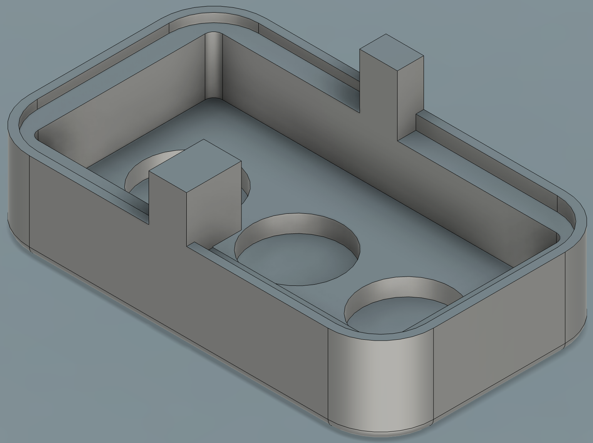
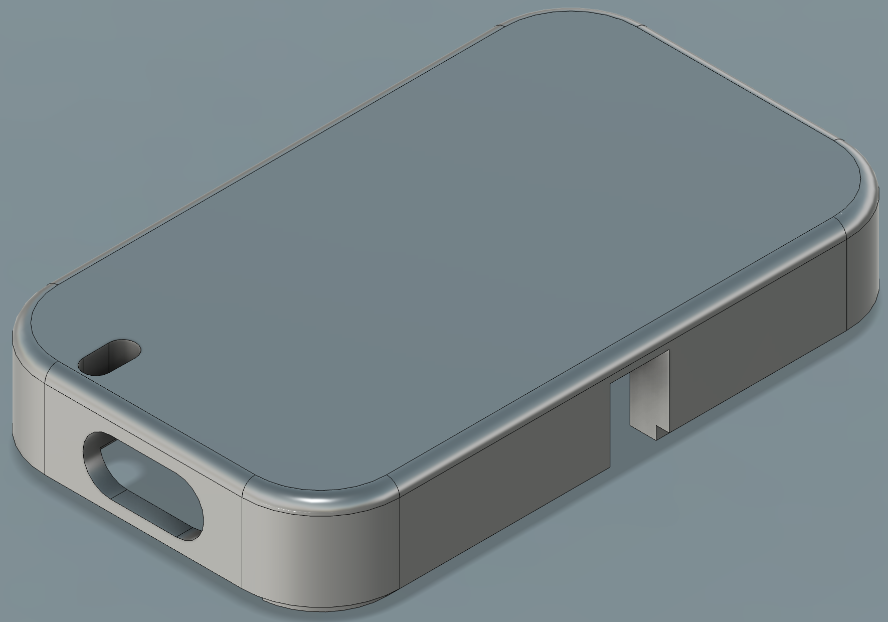
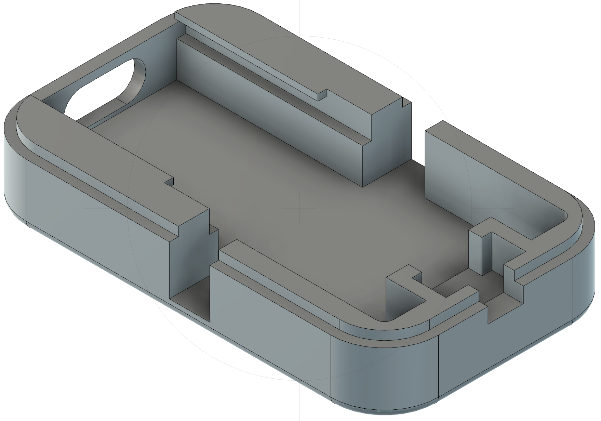

# CAD

Mechanical design source files for the ODKI VBT enclosure.

## Design

Two printed bodies, bonded together permanently with cyanoacrylate (superglue) rather than screwed or snap-fit — there is no intended way to reopen a unit non-destructively once assembled (replacing the battery means breaking the bond and reprinting/regluing).

- **`case-top`** — the main shell, holding the Seeed XIAO nRF52840 Sense. An internal rail guides the board into position as it slides in, until its USB-C connector lines up with a cutout in one of the two short end walls. The **opposite short end** has its own dedicated recess for the power switch. The top face also has a small separate oval window positioned over the onboard RGB status LED, so its color is visible from outside with the case fully closed.
- **`case-bottom`** — the shallower base, holding the LiPo battery and the 3 neodymium magnets (see [`Hardware/BOM`](../BOM/)) in their own blind pockets in the floor of the same compartment, used for the barbell-mount attachment. The magnets go in before the battery is placed, since the battery sits on top of them once the body is populated. A small integrated post does double duty: it keeps the battery from shifting inside the compartment, and — once the two halves are joined — it backs up the XIAO board from behind, so it can't be pushed back out of `case-top`'s rail if the USB-C cable is inserted with some force.

Because the USB-C port stays reachable through `case-top`'s cutout even once the unit is glued shut, a finished unit can still be charged over USB normally, day to day, without ever opening the case — that's the cutout's main job. Re-flashing over USB is also possible through the same cutout, but is only ever a fallback: normal firmware updates go over BLE DFU instead (see `Firmware/DOCUMENTATION.md`).

| `case-bottom`, interior | `case-top`, exterior | `case-top`, interior |
|---|---|---|
|  |  |  |

(Designed in Fusion 360. If a custom PCB is ever designed instead of using the XIAO module directly, its schematic/layout sources (e.g. KiCad) and exported gerbers would also go in this folder.)

## Print settings

Reference settings used for both bodies, printed in **PLA**:

| Setting | Value |
|---|---|
| Layer height | 0.2mm |
| Infill | 95% |
| Supports | Not needed for `case-top`; required for `case-bottom` |

## Files

| File | Format | Purpose |
|---|---|---|
| [`case-top.step`](case-top.step) | STEP | Editable source, opens in FreeCAD or any other CAD tool |
| [`case-top.stl`](case-top.stl) | STL | Ready-to-print mesh, for a slicer (Cura, PrusaSlicer, etc.) |
| [`case-bottom.step`](case-bottom.step) | STEP | Same as above, bottom body |
| [`case-bottom.stl`](case-bottom.stl) | STL | Same as above, bottom body |
| [`case-top.f3d`](case-top.f3d) / [`case-bottom.f3d`](case-bottom.f3d) | Fusion 360 archive | Optional — only useful to someone who also has Fusion and wants the full parametric history (sketches, feature timeline), which STEP does not preserve |

See [`Hardware/Instructions`](../Instructions/) for how these bodies fit together with the electronics into a finished unit.