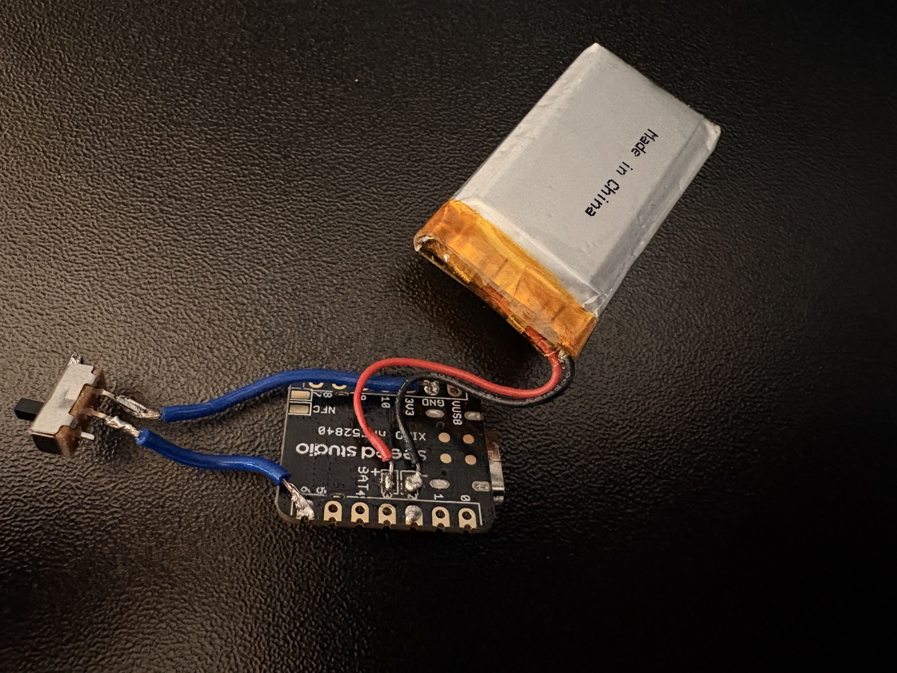
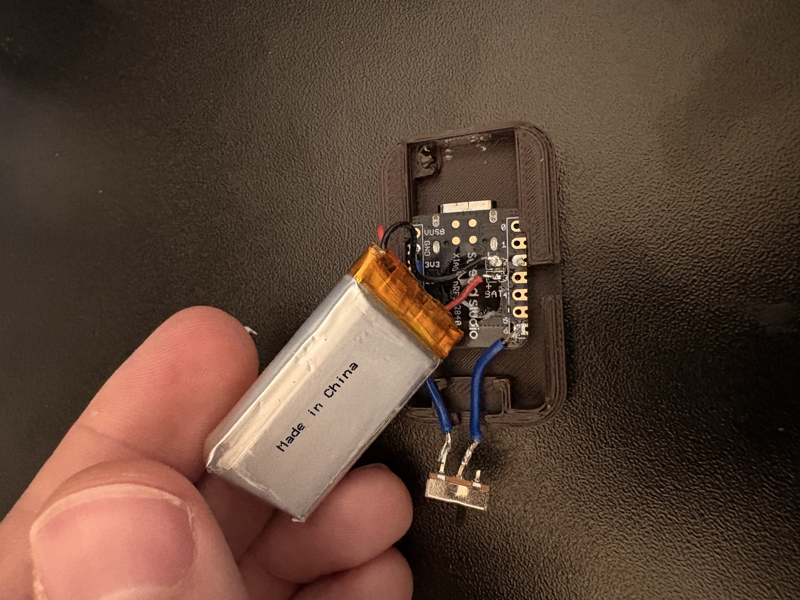
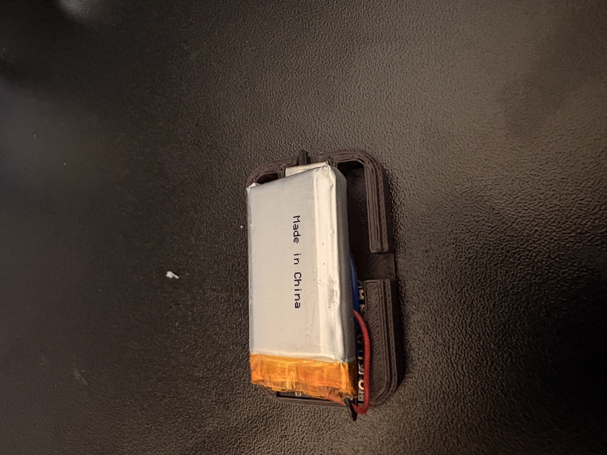

# Assembly Instructions

Step-by-step guide to build one ODKI VBT unit from the parts in [`../BOM`](../BOM/) and the enclosure files in [`../CAD`](../CAD/), ending with a working, glued-shut unit ready for normal use.

## ⚠️ Before you start

This guide assumes you're already comfortable **soldering**, **handling a LiPo battery safely** (short-circuiting, puncturing, or reverse-wiring one can cause a fire), and **flashing firmware onto a bare development board** with the Arduino IDE. If any of that is unfamiliar, get help from someone who has done it before, or practice on scrap hardware first — this is not a beginner-friendly first electronics project.

This design and these instructions are provided as-is, under the terms of [LICENSE-HARDWARE](../../LICENSE-HARDWARE) and [LICENSE-FIRMWARE](../../LICENSE-FIRMWARE) (no warranty of any kind). Building and assembling a unit from them is entirely at your own risk — the author/ODKI accepts no responsibility for any damage to your components, injury, fire, or other loss resulting from it.

## What you need

- All parts from the [BOM](../BOM/): battery, Seeed XIAO nRF52840 Sense, 3 neodymium magnets, power switch, ~4cm of thin hookup wire (x2).
- The two printed case bodies from [CAD](../CAD/): `case-top` and `case-bottom`.
- A soldering iron + solder.
- Cyanoacrylate (superglue) — a small amount for the magnets, a bit more for the final case closure.
- A computer with the Arduino IDE, to flash the firmware (see step 3).
- The ODKI VBT companion app (see [`../../Apps`](../../Apps/)), to run the functional test in step 7.

## 1. Wire the power switch

The switch is used as a plain 2-position on/off contact: only 2 of its 3 pins are used — the **center (common) pin** and **one outer pin**. The third pin stays unused.

1. Cut two lengths of hookup wire, roughly 4cm each.
2. Solder one wire between the XIAO's **GND** pad and the switch's **outer** pin.
3. Solder the other wire between the XIAO's **D6** pad and the switch's **center (common)** pin.

This is the exact pin the firmware calls `WAKE_PIN` (see `Config.h` / `Firmware/DOCUMENTATION.md`, PowerManager chapter) — sliding the switch closed pulls it to GND, which is how the firmware later knows to stay awake instead of going to sleep.

## 2. Connect the battery

Solder the battery's two leads directly to the **B+ / B-** pads on the underside of the XIAO board.

**Double-check polarity before soldering** — match the leads against the pads' silkscreen markings (or the official [Seeed XIAO nRF52840 Sense pinout diagram](https://wiki.seeedstudio.com/XIAO_BLE/) if the marking isn't clear). Reversed polarity on a LiPo connection can damage the board or the battery.

As soon as this connection is made, **the board powers on** — at this point nothing is managing sleep/wake yet (that's firmware behavior, step 3), so it will simply stay on, switch position or not, until it's flashed.

## 3. First firmware flash

Flash the ODKI VBT firmware now, following the Arduino IDE setup in the [main README](../../README.md#getting-started) (`Seeeduino:nrf52` board package, board `xiaonRF52840Sense`, `Seeed Arduino LSM6DS3` library) and `Firmware/DOCUMENTATION.md` for what each file does.

Once flashed, the switch actually does something: closed = powered on, open = deep sleep (see the PowerManager chapter in `Firmware/DOCUMENTATION.md`). Slide it open, confirm the board goes quiet, then close it again before continuing.

## 4. Prepare `case-bottom`: magnets + battery

`case-bottom` has 3 round pockets sized for the magnets, in the floor of the same compartment that holds the battery. A small integrated post inside this compartment keeps the battery pinned in place once everything is seated — it also has a second job in step 6 below.

1. Press the 3 magnets into their pockets. Add a small drop of superglue to each before/as you seat them — the fit is snug, but glue keeps them from ever working loose in use.
2. Let the glue set, then place the battery into the same compartment, on top of the magnets, against the post.

## 5. Mount the electronics in `case-top`

Slide the XIAO board (now wired to the switch and the battery) into `case-top` along its internal rail, in the direction that brings the board's USB-C connector up to the cutout in the short end wall — that's what lets the finished, glued unit be charged normally over USB without ever opening it again (re-flashing through the same port is also possible, but only as a fallback: normal firmware updates go over BLE instead). The **opposite** short end has its own dedicated recess for the switch, so it stays operable from outside once the case is closed.

Don't force the board all the way in yet if you're about to plug in a USB cable (e.g. to double check the flash from step 3) — pushing a cable in can push the board back out of the rail. That's exactly what `case-bottom`'s post (step 4) is there to prevent, but only once the two halves are actually joined — see the next step.

| Battery lifted, board + switch seated in the case | Battery seated in place |
|---|---|
|  |  |

## 6. Close the case (provisionally)

The two halves aren't snap-fit or screwed — the only thing that ever holds them together is the superglue in the final step. For now, don't glue anything yet: just hold the two halves closed (by hand, a rubber band, or a strip of tape) — enough that `case-bottom`'s post backs up the XIAO board against the rail, and everything sits in roughly its final position for the test below.

## 7. Functional test

With the case closed (provisionally) and the switch on, install the companion app and check everything below **before gluing anything**:

- [ ] **LED status** — right after power-on, the status LED blinks red (not connected to the app yet), visible through the small oval window on top of `case-top`. See the StatusLED chapter in `Firmware/DOCUMENTATION.md` for the full state table.
- [ ] **BLE connection** — the app finds the device when scanning, and connects to it successfully. LED should switch from blinking red to solid red (connected, not yet calibrated).
- [ ] **Calibration** — run the app's calibration step (device held still). LED should switch to solid green (calibrated, idle).
- [ ] **Live streaming** — start tracking in the app (LED goes solid blue) and move the device: live velocity data should appear and update in real time, not freeze or stay at zero.
- [ ] **Data sanity** — velocity reads ~0 while the device is genuinely still, rises and falls smoothly and in the expected direction as you move it, and a rep gets detected and reported in the app when you perform one. No wild spikes, NaNs, or values stuck at a clamp.

If **any** of these fail, open the case back up and check the two solder joints from steps 1–2 before assuming it's a firmware issue.

## 8. Permanent assembly

Once every check above passes, open the case one last time, apply cyanoacrylate along the mating edges of `case-top` and `case-bottom`, and close them together for good. From this point on the unit is sealed — see the note in [`../CAD/README.md`](../CAD/README.md) about what that means for future battery replacement.
